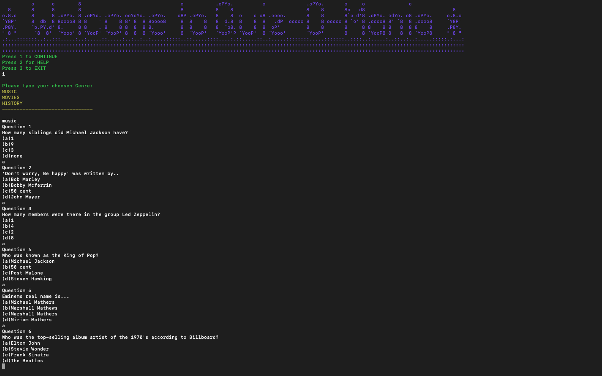
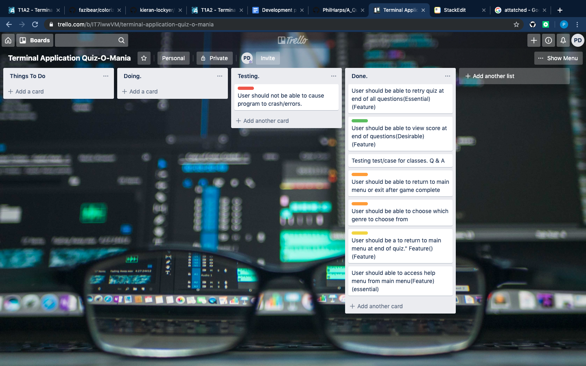
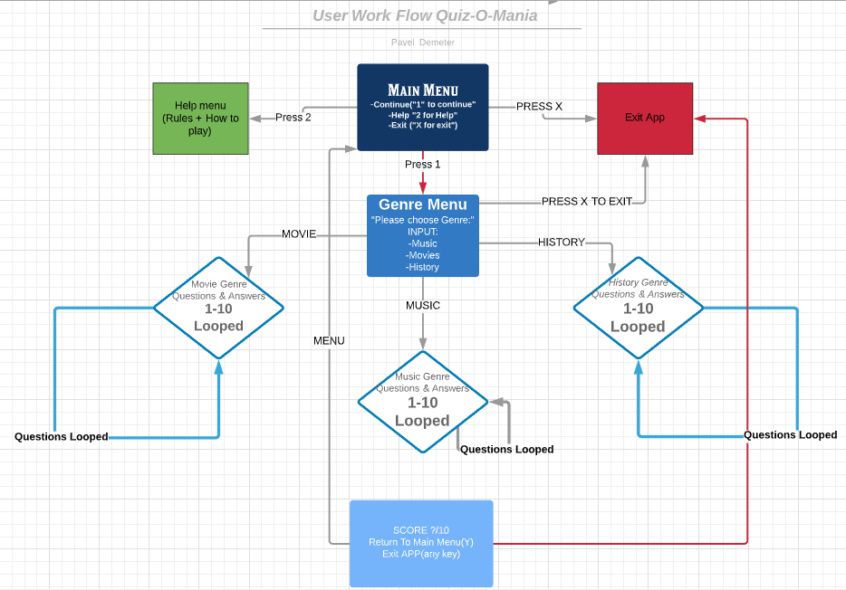


# Quiz-O-Mania

### Terminal Application Project.

  

# Software Developement Plan

  

### Purpose & Scope
Are you ever bored sitting around doing nothing? 
Do your kids always play games that have no benefit to them?

Let me introduce to you..
#### Quiz-O-Mania
Quiz-O-Mania is a single player multiple choice Quiz game that ensures you are both having fun & learning something new! It is very easy to use so any player of any age can play as it includes a HELP menu & provides direct instructions on how to play the game.

Anybody can play this game as no one is old enough to stop learning. You will have different Genre's to choose from such as Music, History & Movies. Each question will have four options for answers, But be careful.. Some are tricky!

I have developed this quiz to improve your and my knowledge of the "Trivia World" we live in (also for all procrastinators out there to fill up their existence of boredom).

---

### Features

The first feature this application has is the 'Genre Selection'. 'Genre selection' was implemented by creating a do loop to keep asking the user which genre to play until they get the choose one of the valid options. If User inputs Music, Movies or History, it will go to the following Genre and return after the quiz has completed.

The second feature this application has is the 'Help Section'. The Help Section was implemented by creating a method which puts instructions on how to play the game & rules. The unless statement was implemented which exits unless you input the key 'y'.
  
The third feature this application has is the 'Score'. The 'Score' was implemented by creating a score variable with an 'if' statement which increments by 1. The score feature then puts out a string with string interpolation of 'score' after each game is completed.

---

  

### **User Interaction and Experience**

When User runs quiz.rb , User is welcomed with "Welcome to Quiz-O-Mania". User is then presented with 3 options. 
- Press 1 to Continue
- Press 2 for Help
- Press 3 to Exit
If users inputs anything other than the following(error). User will be presented with "PLEASE CHOOSE FROM THE FOLLOWING:"

if User enters 2 for help an option to go forth in the help menu to have a full understanding of how the game works and what are the rules.

User enters 2 to continue the game and be presented by the Genre Menu. The Genre menu presents with 3 Genres at the moment, But looking into updating it so the application has specific sub genres for each category, e.g "New movies", "Tv shows", "Modern History".

User is then looped through 10 questions for each genre. If user inputs anything besides valid answers, User will be given an error "Please check answers & Try again" and will be looped until they input corresponding option. After completing 10 questions, User is given a score out of 10.

User then has two options, "Press (Y) to go back to Main Menu" or "Press any other key to exit. If users presses Y, Main menu will appear. Any other key, the app will exit and "Thank you for playing" will be appear.

  

### Prerequisites:

These are the gems I implemented into the program, 
colorize & artii.  Along with built in gem Test/case.
I have included a gem file in root file, but here also follow these links 
download and install gems.

- colorize

[https://rubygems.org/gems/colorize/versions/0.8.1](https://rubygems.org/gems/colorize/versions/0.8.1)

- artii

[https://rubygems.org/gems/artii/versions/2.1.2](https://rubygems.org/gems/artii/versions/2.1.2)
  

### Launching the App:
1.Open CLI/Terminal
2. Navigate to the directory that contains the terminal applicaton files. 
If you don't know how to navigate through the terminal and you are using a mac,
Here is a useful link to the commands: 
MAC: https://www.makeuseof.com/tag/mac-terminal-commands-cheat-sheet/]
WINDOWS:[https://www.thomaskrenn.com/en/wiki/Cmd_commands_under_Windows](https://www.thomas-krenn.com/en/wiki/Cmd_commands_under_Windows)

Open up terminal and navigate to the directory that contains the terminal app files and type `ruby quiz.rb`

  

  

### Screenshots:

### User Stories

  
  

### User Workflow

  

  

  

### List of Tools Used

- Visual Studio Code

- GitHub

- Terminal

- Trello

- Slack

  

  

  

